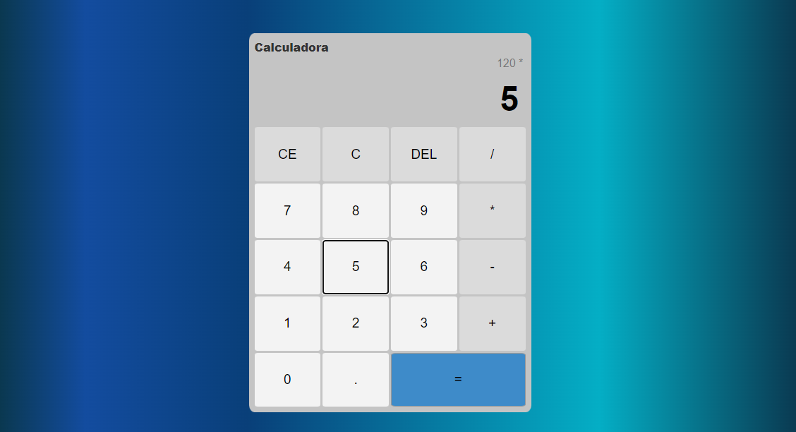

# Calculadora com HTML5, CSS3 e JavaScript

Projeto de estudo simples nível iniciante utilizando HTML, CSS e JavaScript.

Baseado no projeto: https://www.youtube.com/watch?v=KCfaPZ2t2yA&list=PLnDvRpP8Bnezalesxa3xu2yt-zWpsSkhu&index=10

 
 

